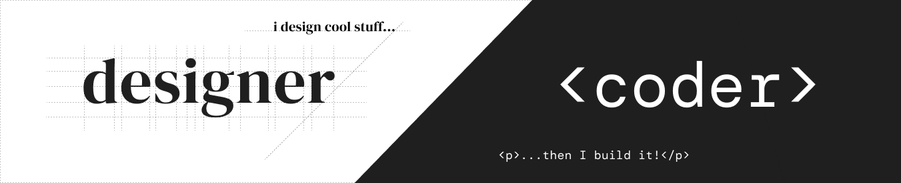

# Hello, folks!  Nice to Meet You. ✌

## More About Me

🙂 I'm happy most of the time (**except in very hot days**)

☕ I drink a lot of coffee (**but I'm trying to reduce**)

💤 I don't sleep well (**maybe it's the coffe?**)

🍙 I speak english (**and also portuguese**)

## 🔧 Technologies & Tools

#### ⌨ Programming Tools

#### 🎨 Design Tools

## 📈 GitHub Stats

  
     

